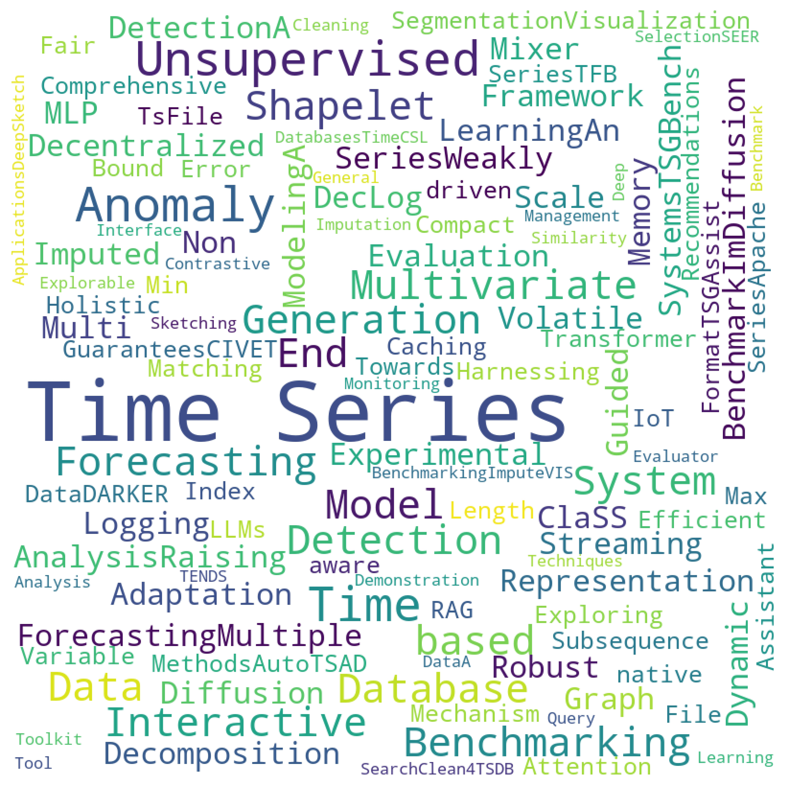
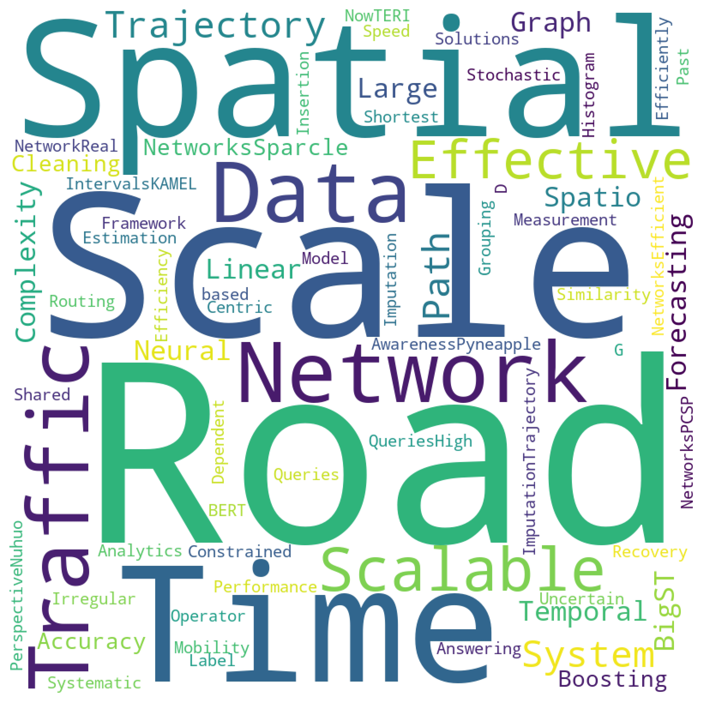

# VLDB 2024 Time Series and Spatial-Temporal Data  Paper Summary

This md summarizes the relevant papers on **Time Series** and **Spatial-Temporal** data from VLDB 24. If there are any omissions, contributions from everyone are welcome. (issue or PR)

**Time Series Topic**：forecasting，anomaly detection, classification, TDBS, TSDM,  benchmark etc. (22 Papers)

**Spatial-Temporal Topic**：traffic forecasting,  route planing,   Trajectory Imputation, Trajectory Recovery, shortest path query etc. (11 Papers)

# Table of contents

> **Time Series**	
>
> 1. DecLog: Decentralized Logging in Non-Volatile Memory for Time Series Database Systems	
> 2. TSGBench: Time Series Generation Benchmark	
> 3. ImDiffusion: Imputed Diffusion Models for Multivariate Time Series Anomaly Detection	
> 4. A Shapelet-based Framework for Unsupervised Multivariate Time Series Representation Learning	
> 5. An Experimental Evaluation of Anomaly Detection in Time Series	
> 6. Weakly Guided Adaptation for Robust Time Series Forecasting
> 7. Multiple Time Series Forecasting with Dynamic Graph Modeling
> 8. A Multi-Scale Decomposition MLP-Mixer for Time Series Analysis
> 9. Raising the ClaSS of Streaming Time Series Segmentation
> 10. Visualization-aware Time Series Min-Max Caching with Error Bound Guarantees
> 11. CIVET: Exploring Compact Index for Variable-Length Subsequence Matching on Time Series
> 12. TFB: Towards Comprehensive and Fair Benchmarking of Time Series Forecasting Methods
> 13. AutoTSAD: Unsupervised Holistic Anomaly Detection for Time Series Data
> 14. DARKER: Efficient Transformer with Dat-driven Attention Mechanism for Time Series
> 15. Apache TsFile: An IoT-native Time Series File Format
> 16. TSGAssist: An Interactive Assistant Harnessing LLMs and RAG for Time Series Generation Recommendations and Benchmarking
> 17. ImputeVIS: An Interactive Evaluator to Benchmark Imputation Techniques for Time Series Data
> 18. A Demonstration of TENDS: Time Series Management System based on Model Selection
> 19. SEER: An End-to-End Toolkit for Benchmarking Time Series Database Systems in Monitoring Applications
> 20. DeepSketch: A Query Sketching Interface for Deep Time Series Similarity Search
> 21. Clean4TSDB: A Data Cleaning Tool for Time Series Databases
> 22. TimeCSL: Unsupervised Contrastive Learning of General Shapelets for Explorable Time Series Analysis
>
> **Spatial-temporal**
>
> 1. BigST: Linear Complexity Spatio-Temporal Graph Neural Network for Traffic Forecasting on Large-Scale Road Networks
> 2. Sparcle: Boosting the Accuracy of Data Cleaning Systems through Spatial Awareness
> 3. Pyneapple-G: Scalable Spatial Grouping Queries
> 4. High-Performance Spatial Data Analytics: Systematic R&D for Scale-Out and Scale-Up Solutions from the Past to Now
> 5. TERI: An Effective Framework for Trajectory Recovery with Irregular Time Intervals
> 6. KAMEL: A Scalable BERT-based System for Trajectory Imputation
> 7. Trajectory Similarity Measurement: An Efficiency Perspective	
> 8. Nuhuo: An Effective Estimation Model for Traffic Speed Histogram Imputation on A Road Network
> 9. Real-time Insertion Operator for Shared Mobility on Time-Dependent Road Networks
> 10. Efficient Stochastic Routing in Path-Centric Uncertain Road Networks
> 11. PCSP: Efficiently Answering Label-Constrained Shortest Path Queries in Road Networks

## Time Series

### 1. DecLog: Decentralized Logging in Non-Volatile Memory for Time Series Database Systems

**链接**：<u>https://www.vldb.org/pvldb/vol17/p1-zheng.pdf</u>

**代码**：<u>https://github.com/Chriszblong/DecLog</u>

**作者**：Bolong Zheng, Yongyong Gao, Jingyi Wan, Lingsen Yan, Long Hu, Bo Liu, Yunjun Gao, Xiaofang Zhou, Christian S. Jensen

**关键词**：time series database management systems (TSDBMS)

### 2. TSGBench: Time Series Generation Benchmark

**链接**：<u>https://www.vldb.org/pvldb/vol17/p305-huang.pdf</u>

**代码**：<u>https://github.com/YihaoAng/TSGBench/</u>

**作者**：Yihao Ang, Qiang Huang, Yifan Bao, Anthony K. H. Tung, Zhiyong Huang

**关键词**：Time Series Generation (TSG), Benchmark

### 3. ImDiffusion: Imputed Diffusion Models for Multivariate Time Series Anomaly Detection

**链接**：<u>https://www.vldb.org/pvldb/vol17/p359-zhang.pdf</u>

**代码**：<u>https://github.com/17000cyh/IMDiffusion</u>

**作者**：Yuhang Chen, Chaoyun Zhang, Minghua Ma, Yudong Liu, Ruomeng Ding, Bowen Li, Shilin He, Saravan Rajmohan, Qingwei Lin, Dongmei Zhang

**关键词**：Anomaly detection, Diffusion, Imputation

### 4. A Shapelet-based Framework for Unsupervised Multivariate Time Series Representation Learning

**链接**：<u></u>

**代码**：<u>https://github.com/real2fish/CSL</u>

**作者**：Zhiyu Liang, Jianfeng Zhang, Chen Liang, Hongzhi Wang, Zheng Liang, Lujia Pan

**关键词**：Time Series Representation Learning, Unsupervised

### 5. An Experimental Evaluation of Anomaly Detection in Time Series

**链接**：<u>https://www.vldb.org/pvldb/vol17/p483-zhang.pdf</u>

**代码**：<u>https://github.com/zaqthss/experiment-tsad</u>

**作者**：Aoqian Zhang, Shuqing Deng, Dongping Cui, Ye Yuan, Guoren Wang

**关键词**：Anomaly detection, evaluation

### 6. Weakly Guided Adaptation for Robust Time Series Forecasting

**链接**：<u>https://www.vldb.org/pvldb/vol17/p766-cheng.pdf</u>

**代码**：<u></u>

**作者**：Yunyao Cheng, Peng Chen, Chenjuan Guo, Kai Zhao, Qingsong Wen, Bin Yang, Christian S. Jensen

**关键词**：Robust time series forecasting, Weak supervise

### 7. Multiple Time Series Forecasting with Dynamic Graph Modeling

**链接**：<u>https://www.vldb.org/pvldb/vol17/p753-zhao.pdf</u>

**代码**：<u>https://github.com/zhkai/MTSF-DG</u>

**作者**：Kai Zhao, Chenjuan Guo, Yunyao Cheng, Peng Han, Miao Zhang, Bin Yang

**关键词**：Time Series Forecasting, dynamic graph

### 8. A Multi-Scale Decomposition MLP-Mixer for Time Series Analysis

**链接**：<u>https://www.vldb.org/pvldb/vol17/p1723-zhong.pdf</u>

**代码**：<u>https://github.com/zshhans/MSD-Mixer</u>

**作者**：Shuhan Zhong, Sizhe Song, Weipeng Zhuo, Guanyao Li, Yang Liu, S.-H. Gary Chan

**关键词**：Time Series Analysis, MLP

### 9. Raising the ClaSS of Streaming Time Series Segmentation

**链接**：<u>https://www.vldb.org/pvldb/vol17/p1953-ermshaus.pdf</u>

**代码**：<u>https://github.com/ermshaua/classification-score-stream</u>

**作者**：Arik Ermshaus, Patrick Schäfer, Ulf Leser

**关键词**：streaming time series segmentation (STSS)

### 10. Visualization-aware Time Series Min-Max Caching with Error Bound Guarantees

**链接**：<u>https://www.vldb.org/pvldb/vol17/p2091-maroulis.pdf</u>

**代码**：<u>https://github.com/athenarc/MinMaxCache</u>

**作者**：Stavros Maroulis, Vassilis Stamatopoulos, George Papastefanatos, Manolis Terrovitis

**关键词**：

### 11. CIVET: Exploring Compact Index for Variable-Length Subsequence Matching on Time Series

**链接**：<u>https://www.vldb.org/pvldb/vol17/p2123-he.pdf</u>

**代码**：<u>https://github.com/CIVET-TS/CIVET</u>

**作者**：Haoran Xiong, Hang Zhang, Zeyu Wang, Zhenying He, Peng Wang, X. Sean Wang

**关键词**：Subsequence matching

### 12. TFB: Towards Comprehensive and Fair Benchmarking of Time Series Forecasting Methods

**链接**：<u>https://www.vldb.org/pvldb/vol17/p2363-hu.pdf</u>

**代码**：<u>https://github.com/decisionintelligence/TFB</u>

**作者**：Xiangfei Qiu, Jilin Hu, Lekui Zhou, Xingjian Wu, Junyang Linn Du, Buang Zhang, Chenjuan Guo, Aoying Zhou, Christian S. Jensen, Zhenli Sheng, Bin Yang

**关键词**：Time Series Forecasting, Benchmark

### 13. AutoTSAD: Unsupervised Holistic Anomaly Detection for Time Series Data

**链接**：<u>https://www.vldb.org/pvldb/vol17/p2987-schmidl.pdf</u>

**代码**：<u>https://hpi.de/naumann/s/autotsad</u>

**作者**：Sebastian Schmidl, Felix Naumann, Thorsten Papenbrock

**关键词**：Unsupervise, Anomaly detection, 

### 14. DARKER: Efficient Transformer with Data-driven Attention Mechanism for Time Series

**链接**：<u>https://www.vldb.org/pvldb/vol17/p3229-zuo.pdf</u>

**代码**：<u>https://github.com/rdzuo/darker</u>

**作者**：Rundong Zuo, Guozhong Li, Rui Cao, Byron Choi, Jianliang Xu, Sourav S Bhowmick

**关键词**：Transformer, Classification 

### 15. Apache TsFile: An IoT-native Time Series File Format

**链接**：<u>https://www.vldb.org/pvldb/vol17/p4064-song.pdf</u>

**代码**：<u>https://github.com/apache/tsfile/</u>

**作者**：nan

**关键词**：IoT, Apache TsFile

### 16. TSGAssist: An Interactive Assistant Harnessing LLMs and RAG for Time Series Generation Recommendations and Benchmarking

**链接**：<u>https://www.vldb.org/pvldb/vol17/p4309-huang.pdf</u>

**代码**：<u>https://github.com/YihaoAng/TSGAssist/</u>

**作者**：Yihao Ang, Yifan Bao, Qiang Huang, Anthony K. H. Tung, Zhiyong Huang

**关键词**：Generation, LLM, RAG

### 17. ImputeVIS: An Interactive Evaluator to Benchmark Imputation Techniques for Time Series Data

**链接**：<u>https://www.vldb.org/pvldb/vol17/p4329-khayati.pdf</u>

**代码**：<u>https://github.com/eXascaleInfolab/ImputeVIS</u>

**作者**：Mourad Khayati, Quentin Nater, Jacques Pasquier

**关键词**：imputation, benchmark

### 18. A Demonstration of TENDS: Time Series Management System based on Model Selection

**链接**：<u>https://www.vldb.org/pvldb/vol17/p4357-chen.pdf</u>

**代码**：<u>https://github.com/yoyo185644/TENDS</u>

**作者**：Yuanyuan Yao, Shenjia Dai, Yilin Li, Lu Chen, Dimeng Li, Yunjun Gao, Tianyi Li

**关键词**：time series management system, model selection

### 19. SEER: An End-to-End Toolkit for Benchmarking Time Series Database Systems in Monitoring Applications

**链接**：<u>https://www.vldb.org/pvldb/vol17/p4361-khayati.pdf</u>

**代码**：<u>https://github.com/eXascaleInfolab/seer</u>

**作者**：Luca Althaus, Mourad Khayati, Abdelouahab Khelifati, Anton Dignös, Djellel Difallah, Philippe Cudre-Mauroux

**关键词**：Time series database systems

### 20. DeepSketch: A Query Sketching Interface for Deep Time Series Similarity Search

**链接**：<u>https://www.vldb.org/pvldb/vol17/p4369-crotty.pdf</u>

**代码**：<u>https://github.com/andrewcrotty/dts3</u>

**作者**：Zheng Zhang, Zhuhan Shao, Andrew Crotty

**关键词**：Similarity Search

### 21. Clean4TSDB: A Data Cleaning Tool for Time Series Databases

**链接**：<u>https://www.vldb.org/pvldb/vol17/p4377-wang.pdf</u>

**作者**：Xiaoou Ding, Song Yichen, Hongzhi Wang, Donghua Yang, Chen Wang, Jianmin Wang

**关键词**：Time series database systems

### 22. TimeCSL: Unsupervised Contrastive Learning of General Shapelets for Explorable Time Series Analysis

**链接**：<u>https://www.vldb.org/pvldb/vol17/p4489-wang.pdf</u>

**代码**：<u>https://github.com/real2fish/CSL</u>

**作者**：Zhiyu Liang, Chen Liang, Zheng Liang, Hongzhi Wang, Bo Zheng

**关键词**：Contrastive Shapelet Learning, Analysis

## Spatial-temporal

### 1. BigST: Linear Complexity Spatio-Temporal Graph Neural Network for Traffic Forecasting on Large-Scale Road Networks

**链接**：<u>https://www.vldb.org/pvldb/vol17/p1081-han.pdf</u>

**代码**：<u>https://github.com/usail-hkust/BigST</u>

**作者**：Jindong Han, Weijia Zhang, Hao Liu, Tao Tao, Naiqiang Tan, Hui Xiong

**关键词**：traffic forecasting, scalable

### 2. Sparcle: Boosting the Accuracy of Data Cleaning Systems through Spatial Awareness

**链接**：<u>https://www.vldb.org/pvldb/vol17/p2349-mokbel.pdf</u>

**代码**：<u>https://github.com/yhuang-db/holoclean-sparcle</u>

**作者**：Yuchuan Huang, Mohamed Mokbel

**关键词**：Data Cleaning Systems, Spatial Awareness

### 3. Pyneapple-G: Scalable Spatial Grouping Queries

**链接**：<u>https://www.vldb.org/pvldb/vol17/p4469-abdelhafeez.pdf</u>

**代码**：<u>https://www.vldb.org/pvldb/vol17/p4469-abdelhafeez.pdf</u>

**作者**：Laila Abdelhafeez, Andres Calderon, Amr Magdy, Vassilis J. Tsotras

**关键词**：spatial grouping queries

### 4. High-Performance Spatial Data Analytics: Systematic R&D for Scale-Out and Scale-Up Solutions from the Past to Now

**链接**：<u>https://github.com/harsha2010/magellan</u>

**代码**：<u>https://www.vldb.org/pvldb/vol17/p4507-wang.pdf</u>

**作者**：Fusheng Wang, Rubao Lee, Dejun Teng, Xiaodong Zhang, Joel Saltz

**关键词**：Hadoop-GIS, spatial data analysis, hardware acceleration

### 5. TERI: An Effective Framework for Trajectory Recovery with Irregular Time Intervals

**链接**：<u>https://www.vldb.org/pvldb/vol17/p414-chen.pdf</u>

**代码**：<u>https://github.com/yileccc/TERI</u>

**作者**：
Yile Chen, Gao Cong, Cuauhtemoc Anda

**关键词**：Trajectory Recovery, irregular

### 6. KAMEL: A Scalable BERT-based System for Trajectory Imputation

**链接**：<u>https://www.vldb.org/pvldb/vol17/p525-musleh.pdf</u>

**代码**：<u>https://github.com/meshalawy/KAMEL</u>

**作者**：Mashaal Musleh, Mohamed F. Mokbel

**关键词**：Trajectory Imputation, BERT

### 7. Trajectory Similarity Measurement: An Efficiency Perspective

**链接**：<u>https://www.vldb.org/pvldb/vol17/p2293-qi.pdf</u>

**作者**：Yanchuan Chang, Egemen Tanin, Gao Cong, Christian S. Jensen, Jianzhong Qi

**关键词**：Trajectory Similarity, efficiency evaluation

### 8. Nuhuo: An Effective Estimation Model for Traffic Speed Histogram Imputation on A Road Network

**链接**：<u>https://www.vldb.org/pvldb/vol17/p1605-yuan.pdf</u>

**代码**：<u>https://github.com/yuanhaitao/Nuhuo.git</u>

**作者**：Haitao Yuan, Gao Cong, Guoliang Li

**关键词**：Traffic speed histograms, imputation,

### 9. Real-time Insertion Operator for Shared Mobility on Time-Dependent Road Networks

**链接**：<u>https://www.vldb.org/pvldb/vol17/p1669-zeng.pdf</u>

**代码**：<u>https://github.com/gzyhkust/Insertion-Operator</u>

**作者**：Zengyang Gong, Yuxiang Zeng, Lei Chen

**关键词**：real-time insertion operator, shared mobility, time-dependent road networks

### 10. Efficient Stochastic Routing in Path-Centric Uncertain Road Networks

**链接**：<u>https://www.vldb.org/pvldb/vol17/p2893-xu.pdf</u>

**代码**：<u>https://github.com/decisionintelligence/Route-sota</u>

**作者**：Chenjuan Guo, Ronghui Xu, Bin Yang, Yuan Ye, Tung Kieu, Yan Zhao, Christian S. Jensen

**关键词**：route planing, stochastic routing, heuristic

### 11. PCSP: Efficiently Answering Label-Constrained Shortest Path Queries in Road Networks

**链接**：<u>https://www.vldb.org/pvldb/vol17/p3082-wang.pdf</u>

**代码**：<u>https://github.com/lbwang95/PCSP</u>

**作者**：SLibin Wang, Raymond Chi-Wing Wong

**关键词**：Shortest Path Queries

## VLDB2024 Papers

VLDB2024 all accepted papers：[VLDB 2024 Papers](https://vldb.org/pvldb/volumes/17/)

